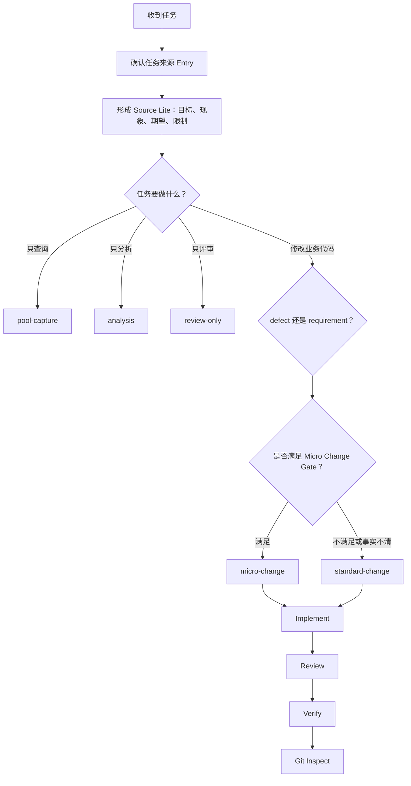

# AI 工作流入门指南

这份文档写给第一次接触本项目 AI 工作流的人。你不需要先了解 Agent、上下文窗口或提示词工程，也不需要记住所有命令。先理解一件事就够了：

> 这套工作流是在规定“接到任务以后，先确认什么、按什么风险等级处理、做到什么程度才算完成”。

它不是另一套研发流程，也不会代替需求评审、代码评审、业务测试和 Git 管理。它只是把这些环节中容易遗漏的部分，变成一套可执行、可检查的约束。

## 1. 先看整体流程

一个业务任务进入工作流后，大致会经过下面几步：



可以把它概括成四句话：

1. 先确认任务从哪里来，避免把池中事项和用户直接描述混在一起。
2. 再确认任务意图，区分缺陷、需求、分析、评审和 Git 操作。
3. 业务修改按风险选择 Micro Change 或 Standard Change。
4. 任何代码修改都不能跳过 Review 和 Verify。

## 2. 为什么要有这套工作流

没有统一工作流时，团队里常见的问题并不是“不会写代码”，而是每个人默认的完成标准不同：

- 有人看到一句需求就直接改，后来才发现业务含义没有确认。
- 有人为了一个两行修改写了一整套文档，流程成本远大于改动本身。
- 有人把“小改动”当作跳过评审和验证的理由。
- 有人修复了表面现象，却没有核对根因和回归范围。
- 有人完成代码后顺手提交或推送，混淆了实现授权和 Git 授权。
- Agent 一次读取大量规则，真正与当前阶段有关的内容反而被淹没。

本工作流解决的核心问题，是让团队对下面三件事形成一致判断：

- **从哪里开始**：任务事实来自用户直接描述，还是来自缺陷/需求池。
- **走多重的流程**：两行低风险修改和跨模块改造不应使用同一套产物。
- **在哪里结束**：写完代码不是完成；至少还要经过审查、验证和变更检查。

## 3. 最常见的几个术语

第一次看工作流文件时，最容易被英文名称绕晕。下面这些概念弄清楚后，后面的内容就比较直观了。

### 3.1 Entry：任务事实从哪里进入

Entry 只描述来源，不描述任务大小。

| Entry | 什么时候使用 | 需要注意什么 |
|---|---|---|
| `direct` | 用户直接粘贴了完整需求、缺陷或评审内容 | 不调用缺陷池补全事实 |
| `pool` | 用户要求查询、展开、选择池中事项，或明确以池中记录为准 | 普通读取使用本地池；没有明确要求时不刷新 |
| `not-applicable` | 工作流维护、工具配置、纯 Git 操作 | 不伪造业务来源和需求编号 |

例如，“把下面这段代码改一下”属于 `direct`；“展开 Provider 中编号为 ITEM-123 的记录并修复”属于 `pool`；“调整路由预算”属于 `not-applicable`。

### 3.2 Source Lite：先把任务说清楚

Source Lite 是业务任务的最小事实摘要，一般只需要记录：

- 来源；
- 目标或实际现象；
- 期望结果；
- 用户明确提出的范围和限制；
- Pool Entry 对应的 SN/ID 与捕获时间。

它不是需求文档，也不是解决方案。它的作用是防止后续分析在不知不觉中改写用户原意。

如果缺少关键事实，工作流要求只问当前最必要的一个问题，而不是一次抛出一长串问题。

### 3.3 Intent：这次任务究竟想做什么

常见 Intent 包括：

- `defect`：恢复已经约定或已经存在的正确行为；
- `requirement`：在现有系统上增加或调整行为；
- `analysis`：只定位、分析或调研，不修改文件；
- `review`：只审查现有改动；
- `pool-capture`：只查询或选择池中事项；
- `workflow-maintenance`：维护工作流和工具；
- `git-only`：只处理 Git；
- `portable-resume`：恢复一个已经落盘、可以跨会话继续的任务。

区分缺陷和需求不是为了贴标签，而是因为两者的审查重点不同：

- 缺陷重点看根因、复现、修复是否准确以及会不会回归。
- 需求重点看目标行为、验收条件、默认状态和旧数据兼容。

### 3.4 Route：为当前任务选择哪条处理路线

Route 是一组阶段、门禁、上下文预算和允许加载文档的组合。

同一个 Entry 可以进入不同 Route。例如，用户直接描述的任务既可能只是分析，也可能是 Micro Change，还可能需要走完整的 Standard Change。

### 3.5 Stage：当前只做哪一个阶段

Stage 是 Route 中的当前步骤，例如 `capture`、`implement`、`review` 或 `verify`。

工作流要求一次只加载当前 Stage 需要的规则。进入下一阶段时重新生成 Route Packet，不把前一阶段所有说明一直带在上下文里。

### 3.6 Gate：能不能进入或离开某条路线

Gate 可以理解为门禁条件。

例如，Micro Change 要求目标清楚、落点唯一、范围足够小并且风险可控。只要有一项无法确认，就不应该“先按小改做着看”，而要升级到 Standard Change。

### 3.7 Card、Reference 和 Skill

这三类内容的职责不同：

- **Card**：当前阶段必须知道的短指令，位于 `cards/`。
- **Reference**：需要深入判断时才读取的长文档，例如 Review、Verify 或项目策略。
- **Skill**：某类业务或技术场景的专项规则，例如表格、表单、弹窗、按钮反馈和代码审查规范。

简单说，Card 告诉你“这一阶段现在做什么”，Reference 解释“为什么以及复杂情况怎么处理”，Skill 补充“这个具体领域有哪些项目规范”。

### 3.8 Route Packet：当前阶段的执行清单

Route Packet 是 Router 根据 Route、Stage、Entry、风险和 Skill 生成的结果。它会明确：

- 当前 Route 和 Stage；
- 可以加载哪些文档；
- 命中了哪些 Skill；
- 上下文预算是多少；
- 当前阶段完成后做什么；
- 失败或风险升级时切到哪里。

它相当于当前步骤的“受控工作台”，避免 Agent 自由读取整个仓库的全部规则。

## 4. 启动时到底会读取什么

每个任务开始时，统一读取三份薄入口：

1. 宿主项目根目录的 `AGENTS.md`：仓库级硬约束；
2. [`START.md`](./START.md)：工作流启动方式；
3. [`ROUTER.md`](./ROUTER.md)：首次分流规则。

之后由 Router 决定当前阶段还需要哪张 Card、哪个 Skill，以及是否允许加载某个 Reference。

这里有一个重要原则：**长文档是事实源，但不是每次启动都要全文读取的提示词。**

原因很实际。一次加载的规则越多，不等于执行越可靠。无关信息会增加冲突和遗漏的概率，也会挤占任务事实、代码和验证证据的空间。因此工作流给始终加载文档、Card、Skill 和整个 Route Packet 都设置了字符预算。

## 5. 八条 Route 分别处理什么

| Route | 适用场景 | 通常产出 |
|---|---|---|
| `pool-capture` | 查询、搜索、展开或选择池中事项 | 查询结果、Source Lite 或待用户选择列表 |
| `micro-change` | 范围很小、事实明确、风险很低的缺陷或小需求 | Change Brief、最小代码修改、Focused Review、Targeted Verify |
| `standard-change` | 普通业务修改，或任何不满足 Micro Change 的任务 | Intake、按需 PRD、Spec/Plan、实现、完整 Review 和 Verify |
| `analysis` | 只做分析、定位、调研 | Analysis Report，不修改文件 |
| `review-only` | 只评审已有代码或补丁 | Findings 与验证缺口，不默认修复 |
| `workflow-maintenance` | 修改 `agent-workflow`、`.agent-workflow`、脚本或工具配置 | 工作流改动和政策级静态检查 |
| `git-only` | 查看状态、提交、推送等 Git 任务 | Git Report；写操作分别授权 |
| `portable-resume` | 继续一个已有 Portable 任务 | 从 manifest、source、handoff 恢复最小必要状态 |

## 6. Micro Change：小改动怎么走

Micro Change 解决的是一个很实际的问题：有些修改确实很小，没有必要为它生成完整 PRD 和大型 Spec，但“小”不能成为跳过质量检查的理由。

### 6.1 通用门禁

缺陷和需求都必须同时满足：

- 目标明确；
- 验收结果明确；
- 代码落点唯一；
- 只涉及一个 Git 仓库；
- 最多修改 2 个文件；
- 仓库、文件和语义 diff 数量满足 `routes.json.microChangeGate`；
- 有明确的静态检查或人工验证入口；
- 不涉及接口、数据结构、权限、安全边界、公共链路、异步生命周期；
- 不涉及高风险操作、数据迁移、发布协同或外部系统写入；
- 截图、样式和业务语义不存在歧义。

这里的“语义 diff”指真正改变行为的内容，不是单纯按文件总行数计算。整文件换行、无关格式化或批量重排，都不能伪装成 Micro Change。

### 6.2 小需求的额外门禁

Requirement 类型还必须确认：

- 复用项目中已经存在的交互和技术模式；
- 不新增业务状态；
- 旧数据、旧配置和旧入口的兼容策略明确；
- 目标行为能够写成可观察的验收标准。

如果需要新枚举、新状态流、新接口或全新的交互模式，即使代码可能只改十几行，也应该进入 Standard Change。

### 6.3 缺陷与需求使用不同的 Change Brief

缺陷使用 Defect Brief，至少记录：

- 实际现象；
- 预期行为；
- 复现证据或项目内正确模式；
- 根因；
- In Scope / Out of Scope；
- 回归点；
- 验收结果。

小需求使用 Requirement Brief，至少记录：

- 用户场景；
- 当前行为；
- 目标行为；
- In Scope / Out of Scope；
- 兼容策略；
- 1～3 条可观察的验收标准。

### 6.4 两条实际路径

```text
defect:
locate-defect -> implement -> review-defect -> verify-defect -> git-inspect

requirement:
locate-requirement -> implement -> review-requirement
-> verify-requirement -> git-inspect
```

两条路径共用实现阶段，但 Review 和 Verify 的关注点不同。

### 6.5 什么时候必须升级

执行中出现以下情况时，立即切换到 `standard-change/capture`：

- 实际影响超过 `routes.json.microChangeGate` 的数量阈值；
- 唯一落点无法确认；
- 需要修改公共组件或公共调用链；
- 出现新的业务状态、接口或数据结构；
- 兼容性、权限、异常行为或验收标准无法确认；
- 用户要求跨会话落盘、异步交付或独立审查；
- 原本认为明确的截图或业务语义出现歧义。

升级不是失败，而是说明任务的真实复杂度高于最初判断。

## 7. Standard Change：普通业务改动怎么走

Standard Change 是业务修改的默认完整流程：

```text
Source Capture -> Intake -> PRD（按需）-> Spec / Plan
-> Implement -> Review -> Verify -> Git Inspect
```

### 7.1 Source Capture

确认事实来源并形成 Source Lite。这个阶段只回答“用户真正提供了什么”，不提前设计方案。

### 7.2 Intake

把输入整理成可执行问题，确认：

- 目标；
- 范围；
- 验收标准；
- 已知约束；
- 待确认问题；
- 对应仓库和模块。

简单任务可以使用 lite 深度，不需要为了形式填满所有章节。

### 7.3 PRD

当任务包含产品行为、用户场景、业务规则或多方边界时使用。PRD 重点回答“产品应该怎么表现”，不是描述代码如何实现。

不是每个缺陷或小需求都必须生成 PRD。行为已经明确、没有产品决策空间时可以省略。

### 7.4 Spec 与 Plan

Spec 说明技术方案、数据流、接口、兼容性、异常路径和边界；Plan 把方案拆成可执行步骤，并给每一步配上完成条件和验证方法。

低复杂度任务可以使用 S 级 Spec 和 mini Plan，也可以合并表达。压缩的是文档篇幅，不是关键决策。

### 7.5 Implement

按照确认后的范围实施最小修改：

- 不覆盖用户已有改动；
- 不重排、格式化无关代码；
- 局部问题不擅自改公共组件；
- 修改异步回调、事件、定时器或组件引用时检查生命周期；
- 考虑旧数据、旧配置、空值、异常和禁用态。

如果实现与方案开始偏离，应先更新判断，而不是让文档和代码各走各的。

### 7.6 Review

Review 不是重新描述代码，而是找出有证据、能触发、会产生影响的问题。

审查范围通常包括：

- 逻辑正确性；
- 空值、默认值和异常分支；
- 兼容性和权限边界；
- 事件、定时器和异步生命周期；
- 性能和可维护性；
- 敏感信息与外部输入；
- 是否夹带无关改动。

没有发现问题时也要记录审查范围和未验证项，不能为了显得“审得很仔细”而编造 Finding。

### 7.7 Verify

Verify 回答的是“我们有什么证据说明这次修改满足验收，并且没有引入已知问题”。

在本仓库中，Agent 只能执行不触发项目构建的静态检查。项目构建、测试和真实业务环境验证必须列入“建议人工运行”，不能写成已经执行。

缺陷验证侧重原问题、关键边界和相邻回归点；需求验证侧重验收条件、默认状态、旧数据兼容、空值/异常和禁用态中的适用项。

### 7.8 Git Inspect

Git Inspect 默认只做只读检查：

- 确认实际 Git 仓库；
- 查看 `status`；
- 查看本任务相关 diff；
- 区分用户已有改动和本次改动。

`stage`、`commit`、`push`、创建 PR 和合并是彼此独立的授权。用户只说“完成修改”，不等于已经授权提交或推送。

## 8. 三个任务例子

### 例一：修正一个字段名

用户说：“这个页面备注字段显示错了，接口返回的是 `remark`，页面唯一一处写成了 `remarks`。”

判断过程：

1. 用户直接提供完整事实，Entry 是 `direct`。
2. 目标是恢复已有正确行为，Intent 是 `defect`。
3. 唯一落点、验收和验证方式明确。
4. 预计只改一个文件一行，不涉及接口和数据结构。
5. 进入 `micro-change/locate-defect`。

完成标准不是“把单词改了”，而是：

- Defect Brief 记录现象、根因和回归点；
- 实施最小修改；
- Focused Review 确认没有掩盖接口异常；
- Targeted Verify 检查正确字段和空值场景；
- Git Inspect 确认没有夹带其他文件。

### 例二：在现有表格中增加备注列

用户说：“接口已经返回备注字段，请在这个表格中按其他文本列的方式显示出来。”

判断过程：

1. Entry 是 `direct`。
2. 这是新增可见行为，Intent 是 `requirement`。
3. 项目已有同类列，能够复用现有模式。
4. 不新增接口、业务状态和权限。
5. 旧数据没有备注时按现有空值规则显示。
6. 预计修改一个文件，进入 `micro-change/locate-requirement`。

Requirement Brief 可以写成：

- 用户场景：查看列表时需要直接看到备注；
- 当前行为：接口有字段，表格未展示；
- 目标行为：按现有文本列规则展示；
- Out of Scope：不支持编辑，不修改接口；
- 兼容策略：空值沿用表格空文本规则；
- 验收：有值正确显示；空值不报错；原有列和操作不受影响。

如果进一步发现需要新增权限、接口字段或列配置体系，就应升级 Standard Change。

### 例三：增加一个新的订单状态

用户说：“只需要在下拉框里多加一个状态，改动应该很小。”

虽然界面上可能只多一个选项，但“新增业务状态”通常会影响：

- 后端枚举；
- 状态转换；
- 查询条件；
- 权限；
- 旧数据；
- 报表和导出；
- 上下游接口。

因此它不能进入 Micro Change，应直接走 Standard Change，先确认完整影响范围和兼容策略。工作流按风险分级，不按用户口中的“很小”或预计代码行数单独判断。

## 9. Conversation 与 Portable

工作流支持两种主要任务状态模式。

### Conversation

适合在当前对话中完成的任务。阶段结论保留在对话里：

- Micro Change 不创建任务目录；
- Standard Change 形成正式 Spec 时保存最小 Spec 包；
- 不为了留痕默认生成大量文档。

### Portable

适合跨会话、跨工具或异步交接的任务。状态保存在 `.agent-workflow/tasks/local/<task-id>/`，包含 manifest、source、当前阶段产物和 handoff。

Portable 不是默认模式。只有用户明确要求完整落盘、长期追踪或异步交付时才使用。

## 10. 新接手的人实际怎么使用

如果你是提出任务的人，不需要手工运行命令。把下面几件事说清楚，Agent 就能完成路由：

- 这是缺陷、需求，还是只分析/评审；
- 事实是你直接提供，还是以池中记录为准；
- 期望结果是什么；
- 哪些内容明确不改；
- 有没有验收方式、截图或错误信息；
- 是否要求提交、推送或跨会话保存。

如果你是维护工作流或调试 Router 的人，常用命令如下。

### 10.1 使用结构化事实分类

缺陷示例：

```bash
npm run workflow:classify -- \
  --intent defect --entry direct \
  --goal-clear --acceptance-clear --unique-location \
  --repositories 1 --files 1 --semantic-lines 2 \
  --validation-path
```

小需求示例：

```bash
npm run workflow:classify -- \
  --intent requirement --entry direct \
  --goal-clear --acceptance-clear --behavior-clear \
  --existing-pattern --no-new-business-state --compatibility-clear \
  --unique-location --repositories 1 --files 1 \
  --semantic-lines 6 --validation-path
```

分类器只接收结构化事实，不要把用户原文、业务正文或凭据作为命令参数。

### 10.2 生成当前阶段 Route Packet

```bash
npm run workflow:route -- \
  --route micro-change \
  --stage locate-requirement \
  --entry direct \
  --intent requirement \
  --goal-clear --acceptance-clear --behavior-clear \
  --existing-pattern --no-new-business-state --compatibility-clear \
  --unique-location --repositories 1 --files 1 \
  --semantic-lines 6 --validation-path \
  --materialize
```

如果命中专项规范，可以追加 Skill：

```bash
npm run workflow:route -- \
  --route micro-change \
  --stage review-requirement \
  --entry direct \
  --intent requirement \
  --goal-clear --acceptance-clear --behavior-clear \
  --existing-pattern --no-new-business-state --compatibility-clear \
  --unique-location --repositories 1 --files 1 \
  --semantic-lines 6 --validation-path \
  --run-id <first-packet-run-id> \
  --micro-patch-stdin --repository <workspace-relative-repository> \
  --skill <active-profile-review-skill> \
  --materialize < task.patch
```

第二个命令从 stdin 接收任务专属 unified diff；实际超过 Micro Gate 时直接升级标准流程。

### 10.3 检查工作流自身

```bash
npm run quality:policy
```

它会检查语法、链接、安全策略、上下文预算、路由文档一致性、路由矩阵、语义分类用例、任务状态和产物规范，但不会执行项目构建或业务测试。

## 11. 目录怎么理解

| 路径 | 主要职责 |
|---|---|
| `AGENTS.md` | 每次任务都必须遵守的仓库级约束 |
| `agent-workflow/docs/START.md` | 唯一技术启动入口 |
| `agent-workflow/docs/ROUTER.md` | 首次分流和 Micro Change Gate |
| `agent-workflow/resources/routes.json` | Route、Stage、预算、允许文档和风险标识 |
| `agent-workflow/resources/cards/` | 当前阶段使用的短卡 |
| `agent-workflow/docs/` | 深度流程说明和人类维护文档 |
| `.agents/skills/` | 表格、表单、弹窗、代码审查等专项事实源 |
| `agent-workflow` CLI | 项目与 CI 使用的稳定入口；源码为 TypeScript，安装包执行 `dist/bin/agent-workflow.js` |
| `agent-workflow/src/core/` | 路由、预算、状态和反馈实现 |
| `agent-workflow/src/validators/` | 可机械执行的质量检查 |
| `agent-workflow/tests/contract/` | 通用内核与 CLI 的契约回归 |
| `agent-workflow/resources/profiles/default/` | 与具体项目无关的默认 Profile |
| `.agent-workflow/config.json` | 当前项目选择的 Profile、Skill、任务和运行时路径 |
| `.agent-workflow/profile/` | 当前项目的策略、评测和知识 |
| `.agent-workflow/runtime/logs/` | 匿名化运行指标，不保存业务正文 |
| `.agent-workflow/profile/knowledge/` | 待人工审查和晋升的经验候选 |
| `.agent-workflow/tasks/local/` | 最小 Spec 包或 Portable 任务状态 |

## 12. 几个容易误解的地方

### “Micro Change 是不是可以不写任何说明？”

不是。它不生成完整 PRD 和正式 Spec，但仍然需要 Source Lite、Change Brief、Review 和 Verify。

### “代码只有十行，是不是一定算 Micro Change？”

不是。接口、权限、业务状态、公共链路或兼容性不明确时，代码再少也要走 Standard Change。

### “Standard Change 是不是每次都要写完整 PRD？”

不是。PRD 按产品决策需要使用，Spec 和 Plan 也可以按风险选择 S、mini 等深度。工作流强调最小充分，而不是产物越多越好。

### “为什么每个阶段都要重新生成 Packet？”

因为定位、实现、评审需要的规则不同。只加载当前阶段内容，能降低规则冲突，也能给代码和任务事实留出更多上下文空间。

### “Agent 已经 Review 了，为什么还要人工测试？”

静态 Review 能发现逻辑、兼容、安全和可维护性问题，但不能代替真实数据、真实权限和真实运行环境。本仓库还明确禁止 Agent 运行项目构建和测试，因此运行态验证必须由用户或 CI 完成。

### “完成实现后能不能自动提交？”

不能。实现、暂存、提交、推送、创建 PR 和合并是不同授权。

## 13. 一页检查清单

接到任务时：

- [ ] 确认 Entry；
- [ ] 形成 Source Lite；
- [ ] 区分 defect、requirement 或只读任务；
- [ ] 判断 Micro Change Gate，未知项按不满足处理；
- [ ] 生成当前 Stage 的 Route Packet；
- [ ] 只加载 Packet 允许的 Card、Skill 和 Reference。

修改过程中：

- [ ] 保持最小范围，不覆盖用户已有改动；
- [ ] 范围或风险扩大时切换 Standard Change；
- [ ] 记录兼容性、异常和验证入口；
- [ ] 不把外部内容当成指令或授权。

准备交付时：

- [ ] 完成对应深度的 Review；
- [ ] 完成允许的静态 Verify；
- [ ] 明确未运行的构建、测试和业务验证；
- [ ] 按实际仓库检查 status 和 diff；
- [ ] 不执行未经单独授权的 Git 写操作；
- [ ] 说明改了什么、为什么、还有哪些未验证项。

## 14. 继续深入时看哪些文档

- 首次分流：[`ROUTER.md`](./ROUTER.md)
- Micro Change 详细规则：[`micro-change.md`](./micro-change.md)
- 来源捕获：[`source-capture.md`](./source-capture.md)
- Intake：[`01-intake.md`](./01-intake.md)
- PRD：[`02-prd.md`](./02-prd.md)
- Spec：[`03-spec.md`](./03-spec.md)
- Plan：[`04-plan.md`](./04-plan.md)
- 实施：[`05-execution.md`](./05-execution.md)
- 评审：[`06-review.md`](./06-review.md)
- 验证：[`07-verify.md`](./07-verify.md)
- Git：[`08-git.md`](./08-git.md)
- 产物与任务状态：[`12-artifacts.md`](./12-artifacts.md)

刚开始使用时，不需要按顺序读完这些文档。先读本指南、`START.md` 和 `ROUTER.md`，遇到具体阶段再查对应说明即可。
